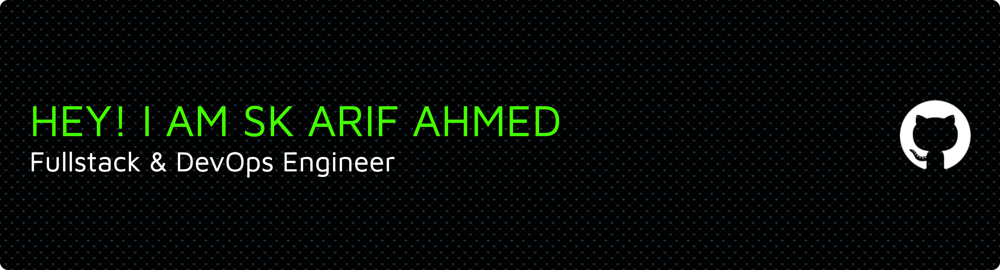

  

  

  
  

 

---

### 💫 About Me

I'm a passionate **Full-Stack Web Developer** with a strong foundation in **Data Structures & Algorithms (Java)** and growing expertise in **DevOps practices**. I enjoy building scalable web applications, designing efficient database systems, and continuously improving my problem-solving skills.

- 🔭 Currently crafting awesome **Full-Stack Projects**.
- 🌱 Mastering **Node.js, Express, REST APIs, SQL, and MongoDB**.
- 🚀 Exploring **DevOps tools** like Docker, Kubernetes, and CI/CD pipelines.
- 💡 Enthusiastic about **clean code, scalable architectures, and system design**.
- 🎯 My goal is to become a **Software Engineer** contributing to impactful projects.

 

> ✨ *“Code is like humor. When you have to explain it, it’s bad.”*

 

---

### 🚀 My Tech Stack

  

  <h4>🎨 Frontend</h4>
  

    

      
      HTML5
    

    

      
      CSS3
    

    

      
      JavaScript
    

    

      
      React
    

    

      
      Redux
    

    

      
      Next.js
    

    

      
      Bootstrap
    

    

      
      Tailwind CSS
    

    

      
      Vite
    

  

  <h4>⚙️ Backend</h4>
  

    

      
      Node.js
    

    

      
      Express.js
    

    

      
      Socket.io
    

    

      
      Prisma
    

  

  <h4>🗄️ Databases</h4>
  

    

      
      MySQL
    

    

      
      PostgreSQL
    

    

      
      MongoDB
    

  

  <h4>📦 DevOps & Cloud</h4>
  

    

      
      Docker
    

    

      
      Kubernetes
    

    

      
      AWS
    

    

      
      Jenkins
    

    

      
      GH Actions
    

  

  <h4>🛠️ Tools & Others</h4>
  

    

      
      GitHub
    

    

      
      Postman
    

    

      
      Vercel
    

    

      
      Netlify
    

  

 

---

### 📊 My GitHub Stats

  
  

 

### 🏆 GitHub Trophies

  

 

### 🔝 Top Contributed Repo

  

---

  

