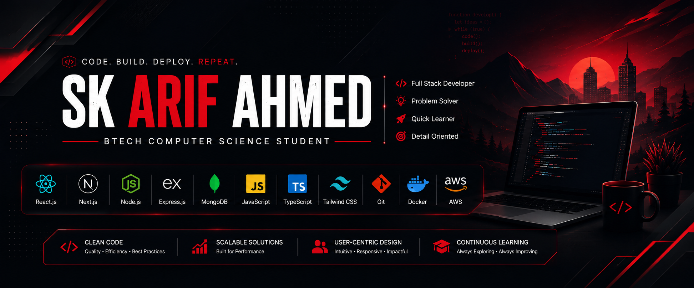

  

  

  
  
  
  

 

---

## 💫 About Me

I'm a passionate **Full-Stack Web Developer** with a strong foundation in **Data Structures & Algorithms (Java)** and growing expertise in **DevOps practices**. I enjoy building scalable web applications, designing efficient database systems, and continuously improving my problem-solving skills.

- 🎓 B.Tech in Computer Science Engineering, Adamas University (2022 – 2026)
- 🔭 Currently crafting awesome **Full-Stack Projects**
- 🌱 Mastering **Node.js, Express, REST APIs, SQL, and MongoDB**
- 🚀 Exploring **DevOps tools** like Docker, Kubernetes, and CI/CD pipelines
- 🧩 400+ problems solved on **LeetCode**
- 💡 Enthusiastic about clean code, scalable architecture, and system design
- 🎯 Goal: become a **Software Engineer** contributing to impactful projects
- ⚡ Fun fact: I've built projects spanning AI agents, fintech compliance tools, and autonomous drone delivery

> ✨ *"Code is like humor. When you have to explain it, it's bad."*

 

---

## 💼 Experience

<table>
  <tr>
    <td width="30%"><b>Software Development Intern</b> Univolve, Kolkata</td>
    <td width="15%">Jun 2025 – Sep 2025</td>
    <td>Built RESTful APIs for an AI-powered mock interview platform.</td>
  </tr>
  <tr>
    <td><b>Cybersecurity Research Intern</b> University College Cork, Ireland (Remote)</td>
    <td>Jun 2025 – Sep 2025</td>
    <td>Built a Flask web app for medical image decoding and secure data handling using AES/RSA encryption.</td>
  </tr>
  <tr>
    <td><b>Software Development Intern</b> KATSI, Toronto, Canada</td>
    <td>Sep 2024 – Apr 2025</td>
    <td>Built a full-stack OFAC compliance platform.</td>
  </tr>
</table>

🚁 Selected for incubation at **CRTDH, IIT Kharagpur** for an autonomous drone delivery platform.

 

---

## 🛠️ Featured Projects

<table>
  <tr>
    <td width="33%" valign="top">
      <b>🍔 BiteDash</b> 
      Multi-vendor food marketplace & delivery platform. 
      <code>React</code> <code>Node.js</code> <code>MongoDB</code> <code>RabbitMQ</code> <code>Redis</code> <code>Socket.io</code>
    </td>
    <td width="33%" valign="top">
      <b>🤖 AI Inventory Management Agent</b> 
      Automated inventory workflow agent. 
      <code>n8n</code> <code>OpenAI</code> <code>Airtable</code>
    </td>
    <td width="33%" valign="top">
      <b>🛡️ OFAC List Checking Platform</b> 
      Compliance web app deployed on AWS & Hostinger. 
      <code>PHP</code> <code>MySQL</code> <code>Figma</code> <code>Visual Paradigm</code>
    </td>
  </tr>
</table>

 

---

## 📌 Pinned Repositories

  
  

⚠️ Replace `YOUR_REPO_NAME` (and add more pin cards) with your actual repo names — pin cards need an exact, existing repo to render.

 

---

## 🚀 Tech Stack

<h3>🎨 Frontend</h3>

<h3>⚙️ Backend</h3>

<h3>🗄️ Database</h3>

<h3>☁️ DevOps & Cloud</h3>

<h3>🔄 Tools & Version Control</h3>

 

---

## 📚 Currently Learning

  

Deepening my knowledge of distributed systems, message queues (Kafka, RabbitMQ), and cloud-native deployment patterns.

 

---

## 🏆 Achievements

  
  
  

 

---

## 📈 GitHub Stats

  
  
  

  

  

 

### 💻 LeetCode Stats

  

 

---

## ⚡ Developer Quote

  

 

---

## 🌐 Connect With Me

  
  
  

  
  
  

 
